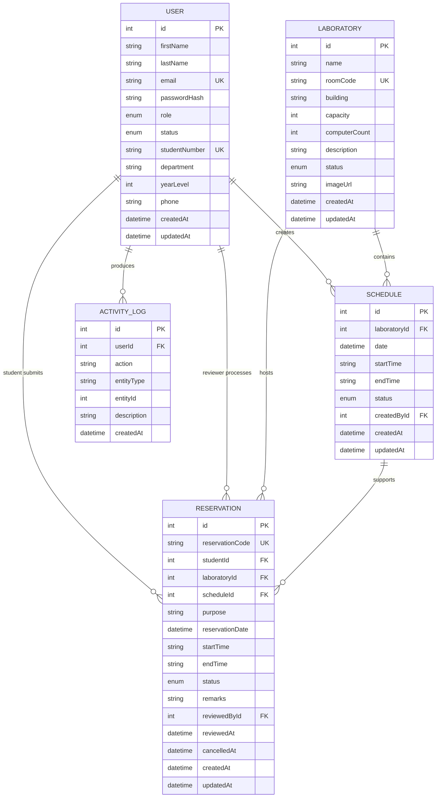

# Entity Relationship Diagram

## Notes

- `users` stores all account roles: Admin, Student, and Laboratory Staff.
- `laboratories` is separated from `schedules` so room information stays reusable.
- `reservations` references both the student and the reviewed-by user for a full approval audit trail.
- `activity_logs` supports recent activity cards in the admin and staff dashboards.
